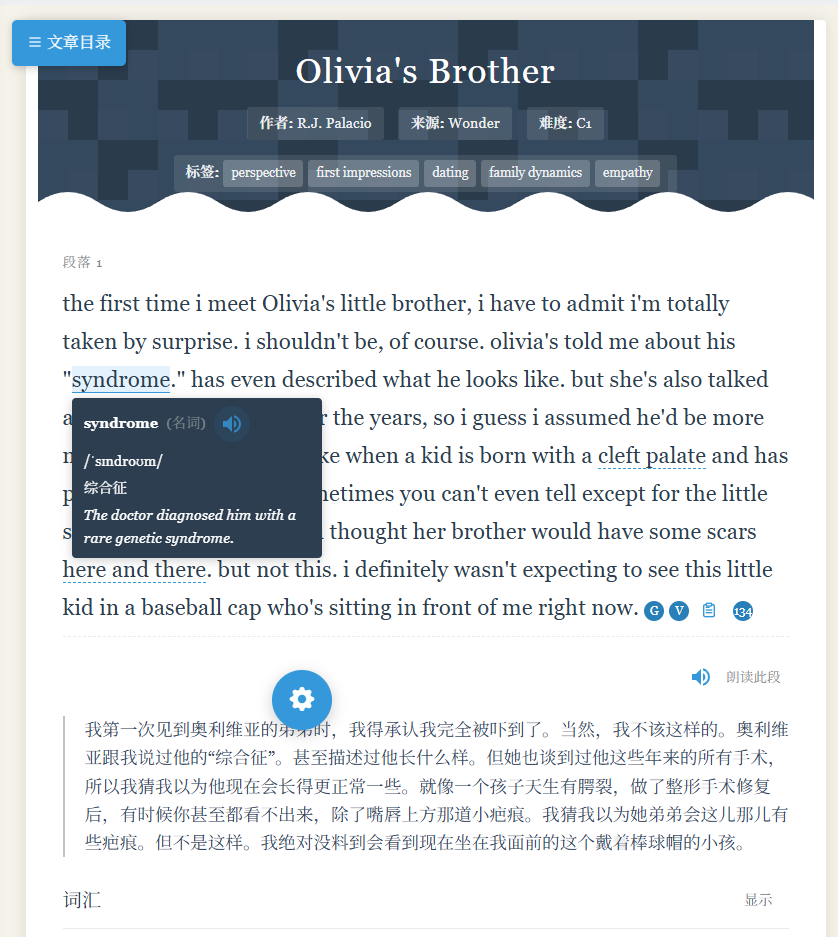
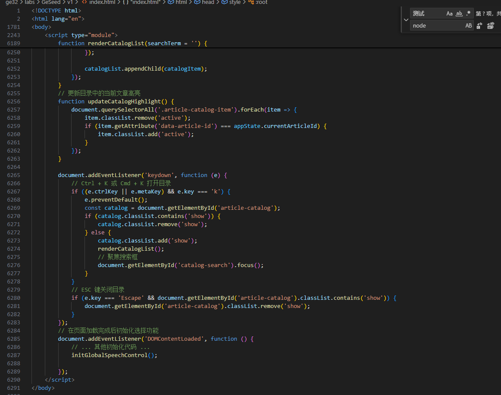

### Ge32 Spotlight

Spotlight是一款英语学习工具，灵感来源于**last Fall(lil peep)**这首歌，这里面有一句歌词，**I was in the back then now I'm in the spotlight**，因此我管它叫做Spotlight。

Soptlight v1 和 v2 本质上页面和功能没有太大的差别，都长下面这个样子：

但是底层代码是完全不同的，有什么不同？

简单来说，v1版本里面的代码是完全写在一个页面里面的：

by the way，最后一定要有Goth风格，但是现在暂时没有，因为很多功能还没有完成。

